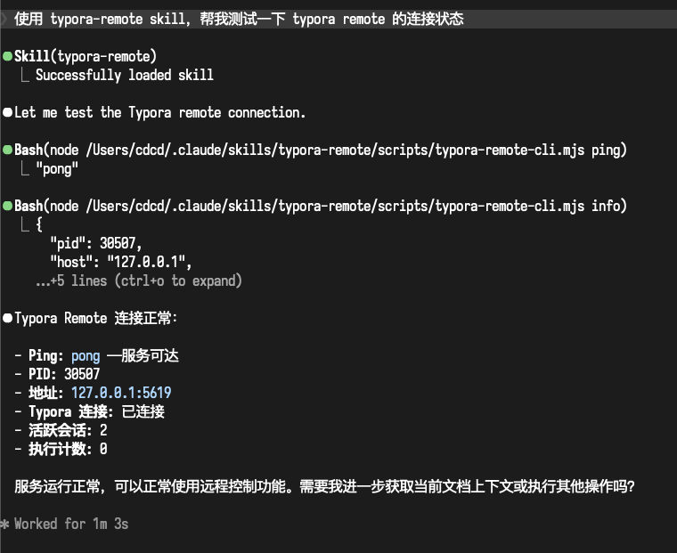
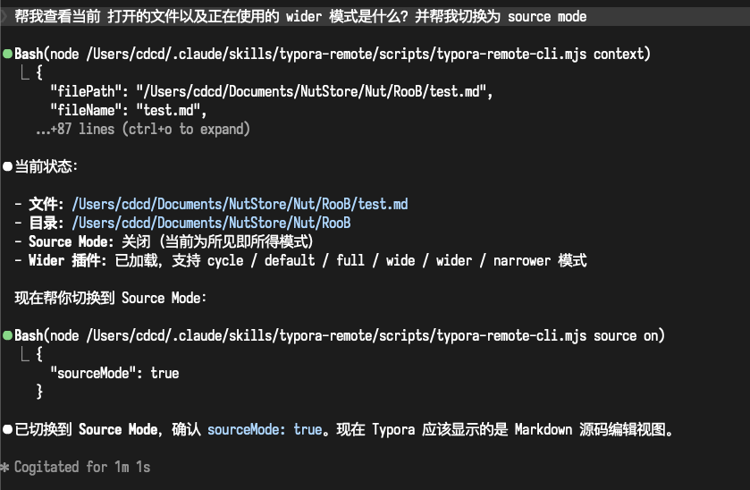

# typora-plugin-remote-skill

An **Agent Skills** marketplace that lets AI agents (Claude Code / Codex / ClawHub / any skill-aware client) drive a running **Typora** instance through the [`typora-plugin-lite`](https://github.com/lr00rl/typora-plugin-lite) `remote-control` sidecar (JSON-RPC over a loopback WebSocket).

This repo follows the [Agent Skills spec](https://agentskills.io/specification) and the layout used by [anthropics/skills](https://github.com/anthropics/skills): one marketplace manifest at `.claude-plugin/marketplace.json`, each skill self-contained under `skills/<name>/`.

## Skills

### 📝 [typora-remote](./skills/typora-remote/SKILL.md)

Inspect or control a running Typora instance: read/replace markdown, switch files or folders, toggle source mode, invoke built-in plugin commands, and execute shell commands through the sidecar.

**Capabilities**

- Read context (`filePath`, `mountFolder`, `sourceMode`, `hasUnsavedChanges`) and current markdown source
- Replace the whole document, insert text at the caret, toggle source mode
- Open a file or switch the mounted folder (with async verification)
- List / enable / disable plugins, list and invoke plugin-owned commands
- Invoke any registered Typora app command
- Run buffered or streaming shell commands through the sidecar (with SIGINT→SIGTERM)
- Raw JSON-RPC escape hatch

## Installation

### Recommended — npx skills (any skill-aware client)

```bash
npx skills install lr00rl/typora-plugin-remote-skill
```

### Claude Code

From your terminal:

```bash
claude plugin marketplace add lr00rl/typora-plugin-remote-skill
```

Or from inside Claude Code:

```
/plugin marketplace add lr00rl/typora-plugin-remote-skill
/plugin install typora-remote@typora-plugin-remote-skill
```

### Codex CLI / TUI

```bash
codex skills install lr00rl/typora-plugin-remote-skill
```

(or `/skills install lr00rl/typora-plugin-remote-skill` inside the Codex TUI)

### ClawhHub / OpenClaw

```bash
clawhub install typora-remote
```

Or just tell OpenClaw directly:

> "Install skills: lr00rl/typora-plugin-remote-skill"

### Manual (for hacking on the skill)

```bash
git clone https://github.com/lr00rl/typora-plugin-remote-skill.git
cp -R typora-plugin-remote-skill/skills/typora-remote ~/.claude/skills/typora-remote
# or
cp -R typora-plugin-remote-skill/skills/typora-remote ~/.codex/skills/typora-remote
```

## Requirements

- **Typora** is running
- [`typora-plugin-lite`](https://github.com/lr00rl/typora-plugin-lite) installed with its `remote-control` plugin **enabled** (it auto-starts a loopback WebSocket sidecar on `ws://127.0.0.1:5619/rpc` and writes a `settings.json` with the bearer token)
- **Node.js ≥ 22** (the bundled client uses the global `WebSocket`)

The client auto-reads the bearer token and host/port from the OS-specific settings path. Override with `--settings <path>` or `--url ... --token ...`.

| Platform | Settings path |
|----------|---------------|
| macOS    | `~/Library/Application Support/abnerworks.Typora/plugins/data/remote-control/settings.json` |
| Windows  | `%APPDATA%/Typora/plugins/data/remote-control/settings.json` |
| Linux    | `~/.local/Typora/data/remote-control/settings.json` |

## Updating

The CLI pings `raw.githubusercontent.com/lr00rl/typora-plugin-remote-skill/main/VERSION`
at most once per 24 hours and prints a one-line stderr notice when a newer
release is available. The check runs fire-and-forget, caches the result
cross-platform under the OS cache dir, and fails silently on any network or
parse error.

When you see the notice, update through the channel you installed with:

| Client | Update command |
|--------|----------------|
| Claude Code | `/plugin marketplace update` |
| Codex CLI / TUI | `codex skills update` |
| `npx skills` | `npx skills install lr00rl/typora-plugin-remote-skill` |
| Manual clone | `git -C <skill-dir> pull --ff-only` |

Opt out of the check entirely by exporting `TPL_SKILL_DISABLE_UPDATE_CHECK=1`.

The top-level `VERSION` file is the single source of truth for the skill
version; `.claude-plugin/marketplace.json` mirrors the same value. See
[`CHANGELOG.md`](./CHANGELOG.md) for release notes.

## Quick check

After install, ask your agent:

> "Use the typora-remote skill to show me the current Typora context."

Or run the bundled CLI directly:

```bash
node ~/.claude/skills/typora-remote/scripts/typora-remote-cli.mjs ping
node ~/.claude/skills/typora-remote/scripts/typora-remote-cli.mjs context
```

## Repository Layout

```text
typora-plugin-remote-skill/
├── .claude-plugin/
│   └── marketplace.json           # Agent Skills marketplace manifest
├── skills/
│   └── typora-remote/
│       ├── SKILL.md               # frontmatter: name, description, license
│       ├── agents/
│       │   └── openai.yaml        # Codex / OpenAI skills display metadata
│       ├── references/
│       │   ├── remote-control-api.md
│       │   ├── plugin-commands.md
│       │   └── typora-capability-inventory.md
│       └── scripts/
│           ├── typora-remote-client.mjs   # importable Node client
│           └── typora-remote-cli.mjs      # CLI used by the skill & humans
├── README.md
└── .gitignore
```

## Examples

### Check connection status

Ask your agent: *"Use typora-remote skill to check the connection status"*



### Query file info & toggle source mode

Ask your agent: *"Show me the current file and switch to source mode"*



## Troubleshooting

| Symptom | Fix |
|---------|-----|
| `Remote control settings not found at ...` | Typora is not running, or the `remote-control` plugin is not enabled |
| `Failed to connect to ws://...` | Sidecar is down — run `Remote Control: Start Local Service` inside Typora |
| RPC error 403 `Invalid token` | Settings file and sidecar token drifted — restart Typora |
| RPC error 503 `Typora session is unavailable` | Sidecar is up but Typora's main process isn't connected — restart Typora |
| Plugin command missing | Plugin is lazy-loaded — enable it first (`enable-plugin <id>`), then `plugin-commands <id>` |
| `Global WebSocket is not available` | Node version too old — upgrade to Node 22+ |

## License

MIT
